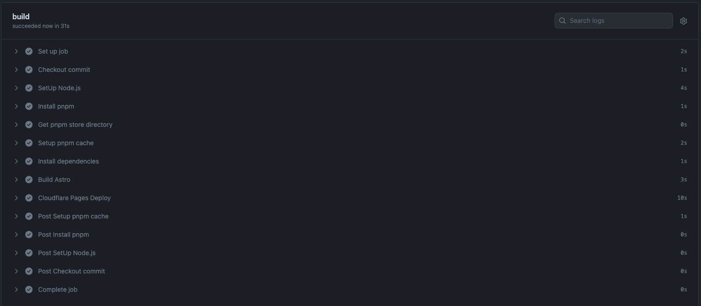

7年とか8年前から個人ブログを作っては消してを繰り返していましたが、そろそろ本腰をいれて個人ブログを作ろうと思いとやっとこさ作成しました。   
~~作り始めてから本格的な公開までなんだかんだで２ヶ月以上掛かっていますが...~~

note とかQiita とかZenn とか大学生の頃から色々わたり歩いて来てここ数年は Zenn を使っていました。  
Zenn も Markdown で書けて、管理も簡単で投げ銭のような機能もありすごく良いサービスなのですが、  
3行くらいの雑な記事や備忘録みたいなものも書きたかったので個人ブログを作成しました。

今回個人ブログを作るに当たって、譲れない点として 今回は記事に持ち出しが簡単になるように本文自体は Markdown
で書くというものを掲げています。  
これなら個人ブログは閉じて Zenn に戻るのも簡単だし、Markdown に対応しているサービスにならそのまま持っていけるのと、  
今使っている技術スタックを変えたくなったときに比較的かんたんに変えれるような仕様にしました。

このプロジェクト自体は GitHub で管理していて、パブリックなリポジトリにしているのでどなたでも見ることができます。  
https://github.com/0maru/blog.0maru.dev

## 技術選定について
---

仕事で使っていない技術を使ってみたいというのもあり、今回は以下の技術を採用しました。  
CSSは好き勝手に書きたかったので、CSSフレームワークは採用していません。

### Astro

https://astro.build/

Astro を採用した理由は Markdown で書いた記事を静的な HTML に変換して配信がしたかったからです。  
他のフレームワークと比較して決定したわけではなく、ほんとに直感的に選びました。  
どのフレームワークを使っても、大体同じ機能があって同じことができるので、ここは本当に好みです。  
実際のところ Next.js でも Gatsby でも Astro でもなんでもよくて、ブログを作り出したとき Astro
が結構活発だった気がしたらから採用しました。  
この記事を書きながらv3 からv4 に更新したので、今のところ最新の Astro を使っています。

Astro を使ってみての感想ですが、ブログを作るには十分すぎるくらいの機能が備わっています。
MarkdownをHTMLに変換する機能は公式でサポートされてい、 RSSの生成など下記のように簡単に作成することが出来ます。

```javascript
import rss from '@astrojs/rss';
import { SITE_DESCRIPTION, SITE_TITLE } from '../consts';

export async function GET(context) {
  const postImportResult = import.meta.glob('../pages/posts/*.md', {eager: true})
  const posts = Object.values(postImportResult)
  return rss({
    title: SITE_TITLE,
    description: SITE_DESCRIPTION,
    site: context.site,
    items: posts.map((post) => ({
        link: post.url,
        ...post.frontmatter,
      }),
    )
  });
}

```

[実際に生成されたRSS | https://blog.0maru.dev/rss.xml](https://blog.0maru.dev/rss.xml)

シンタックスハイライトも Shiki と Prisma が build-in で対応していて設定さえ書けば簡単に導入出来ます。

```:javascript
export default defineConfig({
  markdown: {
    shikiConfig: {
      theme: 'github-dark-dimmed',
      langs: [],
      wrap: true,
    },
  },
});
```

今は検索機能や見出しへのページ内リンクも無いので今後はそういったちょっと便利になるものをコツコツ追加していければと思っています。  
Storybook とか Astro は関係無いですが記事の内容をそのまま「DALL-E 3」に与えて画像を生成できるようなものも準備したいです。

ドキュメントが充実しているので、気になった方は公式ドキュメントを見てください！  
ドキュメントはほとんどのページが日本語に翻訳されていて比較的とっつきやすいと思います。

[Astro | https://astro.build/](https://astro.build/)

[Astro RSSフィードの追加 | https://docs.astro.build/ja/guides/rss/](https://docs.astro.build/ja/guides/rss/)

### Cloudflare Pages

https://pages.cloudflare.com/

最近イケイケだということもありますが、仕事では AWS
ばかりで他のサービスを使用することがないので慣れていない環境にチャレンジしたいと思い採用しました。  
Google Domains がサービス終了するということもあり、ドメインをCloudflare に移管していたのでちょうどよかったです。  
またブログ程度の使い方だとお金がかからないのもありがたいです。

このブログのドメイン自体はCloudflare で管理していて、blog.0maru.dev というサブドメインを作成して,
Cloudflare Pages でホスティングしています。

Cloudflare Pages または Cloudflare の機能を十分に使えているわけではなくて、AWS の S3
に静的ファイルを置いているような感じになっています。  
もう少し調べて開発体験が上がるようなことができるなら設定したいと思っています。

### GitHub Actions

https://github.co.jp/features/actions

Cloudflare Pages はGitHubと統合することができて、push したら自動的に変更が反映される機能があります。  
ただこのプロジェクトでは [asdf](https://asdf-vm.com/) を使ってNode.js のバージョン管理をしていることもあり、
そのままでは使えませんでした。  
なので、GitHub Actions を使ってmain ブランチにpush したら自動的にCloudflare Pages にデプロイするようにしました。

この記事を書いている段階だと大体30秒でビルドとデプロイが完了します。

デプロイのジョブを確認したい場合はGitHub Actions のworkflow を確認してください。  
https://github.com/0maru/blog.0maru.dev/blob/main/.github/workflows/deploy.yml



### その他

#### Google Analytics4

UA が終了して GA4 に移行することになったのですが、未だに操作方法だったりデータの見方が曖昧で、  
調べることが多いので合わせて勉強できるようにGA4を導入しました。

タグ自体はGoogle Tag Manager で管理しています。

## さいごに
---

結局このブログがどこまで続くかはわかりませんが、 Astro とか Cloudflare Pages を仕事で使う機会はなかったのでいい経験になりました。

ブログ一発目の記事でこのようなことを書くことはあまり良くない気もしますが、 NueJS も気になっていて、
来年のこの頃にはAstro 製のブログをNueJS で書き直したみたいなことを書きたいなと思っています。

[NueJS|https://nuejs.org/docs/nuejs/](https://nuejs.org/docs/nuejs/)

レイアウトが一番悩んだので、一回作ってしまえばこれくらいの規模なら数日あれば NueJS
に置き換えれるだろし、 新しいフレームワークを触るにはいいんじゃないかな？と思っています。

ブログ作って思ったことは一番むずかしいのはレイアウトでした。  
素直にテーマとか使っておけばよかったです...  
